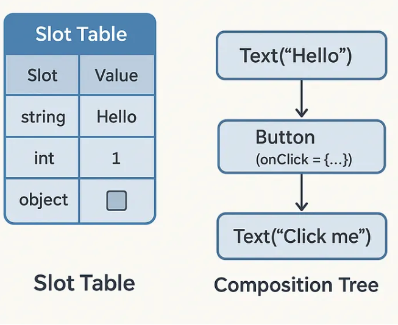

# Hôm nay chúng ta sẽ tìm hiểu về Compose Compiler , Compose Runtime và Slot table trong Compose

# Tác giả : ChungHA (RxMobileTeam)
## Compose Compiler, Runtime và Slot Table

## I. Giới thiệu

Chúng ta sẽ tìm hiểu về Compose Runtime, một phần quan trọng trong việc xây dựng giao diện người dùng với Jetpack Compose. Compose Runtime quản lý cách mà các Composable được hiển thị và cập nhật trên
giao diện người dùng. Nó sử dụng một cấu trúc gọi là "Slot Table" để theo dõi các Composable và trạng thái của chúng.

Nói sơ qua lại 1 chút ve Compose 

1 . Composable là gì?
Composable là một hàm trong Jetpack Compose, cho phép bạn định nghĩa giao diện người dùng một cách declarative. 
Mỗi Composable có thể chứa các thành phần khác và có thể được kết hợp để tạo ra giao diện phức tạp.

ví dụ :
```
Text, Column, Button, LazyColumn
```

2 . Compose Compiler là gì?
- Compose Compiler là một phần của Jetpack Compose giúp chuyển đổi các hàm Composable thành mã máy.
- Nó xử lý việc biên dịch các hàm Composable và tạo ra mã tương ứng để hiển thị giao diện người dùng.

3 : Compose Runtime là gì?
- Compose Runtime là một phần của Jetpack Compose, chịu trách nhiệm quản lý việc hiển thị và cập nhật các Composable trên giao diện người dùng.
- Nó sử dụng một cấu trúc gọi là "Slot Table" để theo dõi các Composable và trạng thái của chúng, giúp đảm bảo rằng giao diện người dùng luôn được cập nhật một cách hiệu quả.
- Dễ hiểu hơn, Nó giống như người đạo diễn, đảm bảo rằng các diễn viên (Composable) được sắp xếp đúng vị trí và thực hiện đúng vai trò của mình trên sân khấu (giao diện người dùng).
- Nó luôn theo dõi các thay đổi trong trạng thái của Composable và cập nhật giao diện người dùng khi cần thiết.

4 .Slot Table là gì?
- Slot Table là một cấu trúc dữ liệu trong Compose Runtime, được sử dụng để quản lý các Composable và trạng thái của chúng.
- Nó cho phép Compose Runtime theo dõi các Composable và cập nhật chúng một cách hiệu quả khi có thay đổi trong trạng thái.
- Slot Table chứa các "slot" (vị trí) cho mỗi Composable, và mỗi slot có thể chứa một Composable hoặc một giá trị trạng thái.
- Slot Table giúp Compose Runtime xác định các Composable nào cần được cập nhật khi có thay đổi trong trạng thái, từ đó giảm thiểu việc vẽ lại giao diện người dùng không cần thiết.

## II Đi sâu vào tìm hiểu Compose Runtime và Slot Table

Compose Runtime: Nhạc trưởng của Recomposition
Hãy chuyển từ sự khéo léo tài tình của Compose Compiler sang động cơ mạnh mẽ mang mọi thứ vào cuộc sống
Nếu compiler là thành viên ẩn mình của đội ngũ sân khấu, người sắp xếp lại kịch bản đằng sau hậu trường, thì runtime chính là đạo diễn sân khấu, đảm bảo rằng mỗi nốt nhạc được tấu lên đúng thời điểm và đúng trình tự.
Runtime được điều khiển bởi trạng thái, không chỉ cập nhật UI khi có thay đổi xảy ra mà còn thực hiện theo cách cực kỳ hiệu quả và thông minh.
Runtime hoàn thành kỳ công này bằng cách sử dụng các cấu trúc như SlotTable. Vẻ đẹp của Compose Runtime nằm ở khả năng điều phối mọi hành động để đáp ứng với những thay đổi state trong khi vẫn duy trì hiệu suất.

Nhưng làm thế nào runtime đạt được điều này? Điều gì diễn ra bên dưới khiến nó trở nên mượt mà, hiệu quả, và quan trọng nhất, phản ứng nhanh đến vậy?

- Tưởng tượng compose runtime luôn quan sát các Composable, như một người giám sát chăm chú theo dõi từng diễn viên trên sân khấu. Khi có thay đổi trong trạng thái, runtime sẽ xác định các Composable nào cần được cập nhật và thực hiện việc đó một cách hiệu quả.
Vậy hiệu quả của việc này là gì? Runtime không chỉ giúp giao diện người dùng luôn được cập nhật mà còn giảm thiểu việc vẽ lại không cần thiết, từ đó cải thiện hiệu suất ứng dụng.

Ví dụ dưới đây minh họa cách Compose Runtime hoạt động với Slot Table:

```kotlin
var saySomething by remember { mutableStateOf("") }
```

- Trong ví dụ này, `saySomething` là một biến trạng thái được quản lý bởi Compose Runtime. Khi giá trị của `saySomething` thay đổi, Compose Runtime sẽ xác định các Composable nào phụ thuộc vào biến này và cập nhật nó0.
remember là gì? `remember` là một hàm trong Compose Runtime, cho phép bạn lưu trữ trạng thái trong một Composable. Khi Composable được gọi lại, giá trị của `saySomething` sẽ được giữ nguyên, giúp tránh việc tạo lại giá trị mỗi lần Composable được vẽ lại.
Đó là cách chúng ta đang hiểu đơn thuần về remember, nhưng thực tế nó là một phần của Compose Runtime
- Bên trong, nó không chỉ đơn thuần lưu giữ giá trị; nó còn liên kết giá trị đó với một slot, một vị trí bộ nhớ mà Compose sử dụng để theo dõi trạng thái qua các lần recomposition. 
- Khi trạng thái không thay đổi, runtime không cần tạo lại; nó chỉ đơn giản tái sử dụng vị trí bộ nhớ đang lưu giữ giá trị đó.
- Điều này giúp giảm thiểu việc sử dụng bộ nhớ và tăng hiệu suất, vì không cần phải tạo lại các đối tượng không cần thiết.
Chúng ta sẽ tìm hiểu remember internals :


```
@Composable
inline fun <T> remember(
    crossinline calculation: @DisallowComposableCalls () -> T
): T = currentComposer.cache(false, calculation)
```

```
inline fun <T> cache(invalid: Boolean, block: () -> T): T {
    var result = nextSlotForCache()
    if (result === Composer.Empty || invalid) {
        val value = block()
        updateCachedValue(value)
        result = value
    }

    @Suppress("UNCHECKED_CAST")
    return result as T
}
```

Đúng là `Talk is cheap, show me the code!` 
- Trong đoạn mã trên, `remember` sử dụng `currentComposer.cache` để lưu trữ giá trị của `saySomething`.
- Nếu giá trị đã được lưu trữ trước đó và không thay đổi, Compose Runtime sẽ sử dụng lại giá trị đó mà không cần tạo lại.
- Nếu giá trị thay đổi, nó sẽ gọi `calculation` để tính toán giá trị mới và cập nhật slot tương ứng trong Slot Table.
Hiểu đơn giản : cache đảm bảo rằng giá trị được lưu trữ trong một vị trí bộ nhớ cụ thể. Nếu trạng thái không thay đổi, vị trí đó vẫn giữ nguyên. Nếu có thay đổi, vị trí đó được cập nhật

### Slot Table: Cấu trúc dữ liệu của Compose Runtime

Slot Table là một cấu trúc dữ liệu quan trọng trong Compose Runtime, giúp quản lý các Composable và trạng thái của chúng.
Nó hoạt động như một bảng, trong đó mỗi hàng đại diện cho một Composable hoặc một giá trị trạng thái.
Mỗi Composable được ánh xạ đến một slot trong Slot Table, và mỗi slot có thể chứa một Composable hoặc một giá trị trạng thái.



Đây không phải là một cấu trúc dữ liệu bình thường, nó là bí mật của Compose

- Nó sẽ ghi chép bộ nhớ có cấu trúc dạng Tree, được tối ưu hóa cao, ghi lại nơi mỗi phần của giao diện người dùng đã tồn tại và sẽ tồn tại trong quá trình recomposition.
- Cấu trúc dạng Tree này rất hữu ích vì nó phản ánh cây phân cấp UI, cho phép cập nhật hiệu quả các phần cụ thể của cây UI.

Vậy điều này hoạt động như thế nào? 

- Khi một composable được thực thi lần đầu tiên, Compose Runtime duyệt qua nó, save các slot trong SlotTable. 
- Những slot này nắm bắt mọi thứ từ các tham số đến các giá trị trạng thái đã ghi nhớ và cả các SideEffect. 
- Sau đó, khi đến thời điểm recomposition, nó xem lại những slot này — không phải để rebuild mà để reuse hoặc bỏ qua hoặc cập nhật

Vậy Slot trong Slot Table là gì?
- Mỗi slot trong Slot Table đại diện cho một Composable hoặc một giá trị trạng thái.
- Một slot là một biểu diễn trừu tượng của một vị trí trong cây composition. 
- Mỗi slot lưu trữ dữ liệu có thể là một remembered value, một groups Slot, hoặc Nothing :pray

Tóm lại : Một chuỗi các slot được group lại thành 1 group lớn, khi Compose thực hiện recomposition, nó sẽ duyệt qua các slot này và quyết định xem có cần cập nhật hay không, và thực hiện chính xác các cập nhật cần thiết.

--> Trong triển khai thực tế, Compose sử dụng một cấu trúc phức tạp dựa trên mảng để tối ưu hiệu suất

Link: Vào đọc nhé người :v
```
https://cs.android.com/androidx/platform/frameworks/support/+/androidx-main:compose/runtime/runtime/src/commonMain/kotlin/androidx/compose/runtime/SlotTable.kt
```

Việc triển khai cụ thể như link, mình chỉ tóm tắt lại thôi :pray

```agsl
internal class SlotTable : CompositionData, Iterable<CompositionGroup> {
     /**
     * Tracks the number of active readers. A SlotTable can have multiple readers but only one
     * writer.
     */
    private var readers = 0

    /**
     * Tracks whether there is an active writer.
     */
    internal var writer = false
        private set
    /**
     * An internal version that is incremented whenever a writer is created. This is used to
     * detect when an iterator created by [CompositionData] is invalid.
     */
    internal var version = 0
  
     /**
     * An array to store group information that is stored as groups of [Group_Fields_Size]
     * elements of the array. The [groups] array can be thought of as an array of an inline
     * struct.
     */
    var groups = IntArray(0)
        private set
        
    /**
     * The number of groups contained in [groups].
     */
    var groupsSize = 0
        private set
        
    /**
     * An array that stores the slots for a group. The slot elements for a group start at the
     * offset returned by [dataAnchor] of [groups] and continue to the next group's slots or to
     * [slotsSize] for the last group. When in a writer the [dataAnchor] is an anchor instead of
     * an index as [slots] might contain a gap.
     */
    var slots = Array<Any?>(0) { null }
        private set
        
    /**
     * The number of slots used in [slots].
     */
    var slotsSize = 0
        private set
        
    /**
     * A list of currently active anchors.
     */
    internal var anchors: ArrayList<Anchor> = arrayListOf()
}
```
- Chúng ta thấy rằng, nó không dùng Data Class mà dùng Array để lưu trữ các slot,
việc này giúp tăng hiệu suất và giảm overhead của việc sử dụng các đối tượng phức tạp.
nó là flat array thì khi đó các thao tác insert, hay read sẽ nhanh,  O(1) hoặc gần như O(1)
- Mỗi group trong groups array giúp Compose xác định vị trí và nội dung của một composable.
- Khi recomposition xảy ra, nó sẽ xác định xem các group này đã được move đi hay chưa, hay remembered value đã thay đổi hay chưa, còn valid không, hay Empty không,
- Nếu xác định rằng một group đã bị move đi, nó sẽ cập nhật các slot tương ứng trong Slot Table.
- Nếu có thể bỏ qua một group (ví dụ như không có thay đổi gì), nó sẽ không cần phải cập nhật lại các slot trong group đó, giúp tiết kiệm thời gian và tài nguyên.
- Nếu không, nó sẽ cập nhật các slot tương ứng trong Slot Table và tiếp tục:

- `readers` và `writer` được sử dụng để quản lý việc truy cập đồng thời vào Slot Table.
- Chỉ có một writer có thể hoạt động tại một thời điểm, trong khi có thể có nhiều readers.
- Điều này đảm bảo rằng việc cập nhật Slot Table là an toàn trong môi trường đa luồng.


### Slot Reuse: Tái sử dụng Slot trong Slot Table
- Khi bạn gọi remember { mutableStateOf(...) }, Compose không đơn giản chỉ tạo một state holder mới lung tung.
- Nó kiểm tra vị trí slot hiện tại trong SlotTable. Nếu có một giá trị đã được lưu trong bộ nhớ cache và nhóm slot không thay đổi, nó sẽ tái sử dụng giá trị đó còn nếu không, nó sẽ ghi một giá trị mới.

```agsl
/**
     * Read the slot table in [block]. Any number of readers can be created but a slot table cannot
     * be read while it is being written to.
     *
     * @see SlotReader
     */
    inline fun <T> read(block: (reader: SlotReader) -> T): T =
        openReader().let { reader ->
            try {
                block(reader)
            } finally {
                reader.close()
            }
        }

    /**
     * Write to the slot table in [block]. Only one writer can be created for a slot table at a time
     * and all readers must be closed an do readers can be created while the slot table is being
     * written to.
     *
     * @see SlotWriter
     */
    inline fun <T> write(block: (writer: SlotWriter) -> T): T =
        openWriter().let { writer ->
            var normalClose = false
            try {
                block(writer).also { normalClose = true }
            } finally {
                writer.close(normalClose)
            }
        }

```

Trên đây là code đọc và ghi vào Slot Table, nó sử dụng các hàm `openReader()` và `openWriter()`.
- `openReader()` sẽ tạo một `SlotReader`, cho phép bạn đọc các giá trị từ Slot Table.
- `openWriter()` sẽ tạo một `SlotWriter`, cho phép bạn ghi các giá trị vào Slot Table.

- Khi bạn gọi `remember`, Compose sẽ sử dụng `SlotWriter` để ghi giá trị vào Slot Table.
- Nếu giá trị đã tồn tại trong Slot Table, nó sẽ tái sử dụng giá trị đó thay vì tạo một giá trị mới.
- Nhưng không đơn giản là việc caching giá trị, mà nó còn táiu sử dụng có cấu trúc với độ chính xác cao
- Trong cái quá trình recomposition xẩy ra,  Compose sẽ move `reader` qua Slot Table, và nó cũng tạo luôn 1 `writer` để có thể replace 1 cách chọn lọc những slot cần thiết, và bỏ qua những slot không cần thiết.

Việc đảm bảo và duy trì các groups nhất quán này nó sử dụng 1 class gọi là Anchor

```agsl
/**
 * An [Anchor] tracks a groups as its index changes due to other groups being inserted and removed
 * before it. If the group the [Anchor] is tracking is removed, directly or indirectly, [valid] will
 * return false. The current index of the group can be determined by passing either the [SlotTable]
 * or [SlotWriter] to [toIndexFor]. If a [SlotWriter] is active, it must be used instead of the
 * [SlotTable] as the anchor index could have shifted due to operations performed on the writer.
 */
internal class Anchor(loc: Int) {
    internal var location: Int = loc
    val valid
        get() = location != Int.MIN_VALUE

    fun toIndexFor(slots: SlotTable) = slots.anchorIndex(this)

    fun toIndexFor(writer: SlotWriter) = writer.anchorIndex(this)

    override fun toString(): String {
        return "${super.toString()}{ location = $location }"
    }
}
```

Những anchor này, được gắn với các group ID, cho phép Compose duy trì tham chiếu đến các group cụ thể ngay cả khi table thay đổi trong quá trình recomposition,
đảm bảo tính ổn định và hiệu quả trong quá trình cập nhật UI. 
Đây là cách để theo dõi vị trí cụ thể của một composable trong slot table.

Tóm lại :
SlotTable là thứ cho phép Compose:
- Tái sử dụng chính xác các vị trí bộ nhớ cho các giá trị như remember qua các lần recomposition.
- Bỏ qua toàn bộ các phần của tree composition khi các đầu vào không thay đổi.
- Khôi phục UI hiệu quả sau các thay đổi cấu hình hoặc bỏ qua recomposition.
- Nếu không có SlotTable, Compose sẽ phải chạy lại mọi composable, khởi tạo lại mọi trạng thái, và khởi chạy lại mọi side effect. 

Và khi độ phức tạp của UI tăng lên, Compose cần các cách để duy trì hiệu quả. Đây là lúc Group Introspection và Anchor Stability phát huy tác dụng.
- Group Introspection cho phép Compose kiểm tra cấu trúc của một nhóm composition mà không cần chạy lại mã của nó.
- Thay vì thực thi nhóm một cách lung tung, Compose phân tích các key và boundaries của nhóm để hiểu rõ hơn về cách mà các Composable được tổ chức và liên kết với nhau.

Bằng cách phân tích các key và boudaries của nhóm, nó có thể:
- Xác định liệu một group có thể được bỏ qua hoàn toàn hay không?
- Tối ưu hóa việc phân bổ bộ nhớ cho các cấu trúc stable.
- Anchor Stability là cơ chế đảm bảo việc nhận dạng nhất quán các phần tử UI qua các lần recomposition. Khi làm việc với danh sách hoặc nội dung động,stable là yếu tố quan trọng cho hiệu suất.

Ví dụ :
```agsl
LazyColumn {
    items(players) { player ->
        PlayerView(player)
    }
}
```
- Nếu không có Anchor Stability, mỗi lần danh sách `users` thay đổi, Compose sẽ phải tái tạo toàn bộ danh sách, dẫn đến hiệu suất kém.
- quá trình recomposition có thể tạo lại tất cả các item một cách không cần thiết khi chỉ có một item thay đổi.

Vậy cách nào để Compose đảm bảo rằng chỉ những phần tử thực sự thay đổi mới được cập nhật?

- Compose sử dụng một cơ chế gọi là "key" để xác định các phần tử trong danh sách. Mỗi phần tử có một key duy nhất,
- Và khi danh sách thay đổi, Compose sẽ so sánh các keys để xác định phần tử nào đã thay đổi.

```agsl

LazyColumn {
    items(players, key = { player -> player.id }) { player ->
        PlayerView(user)
    }
}
```

==> Đã xong về Slot Table, Slot Reuse và Compose Runtime, vậy câu hỏi đặt ra là 
Sao nó biết được khi nào cần cập nhật UI, khi nào không cần cập nhật UI, và làm thế nào để tránh việc vẽ lại không cần thiết?
thì lúc đó là Recomposer sẽ vào cuộc

### Recomposer
SlotTable — lưu trữ của state.
- Recomposer là một phần của Compose Runtime, chịu trách nhiệm xác định khi nào cần cập nhật giao diện người dùng.
- Recomposer chịu trách nhiệm điều khiển các thay đổi thông qua composition dựa trên những thay đổi trạng thái hoặc các trigger bên ngoài (như LaunchedEffect, mutableStateOf, hoặc snapshotFlow). 
- Nhưng điều kỳ diệu nằm ở cách nó composition những thay đổi này đồng bộ với SlotTable, đơn giản là  sử dụng thuật toán duyệt Tree.


Đây là chuỗi sự kiện xảy ra khi một trạng thái thay đổi trong Compose:

1. Một state holder (ví dụ: MutableState) cập nhật.
2. Nó thông báo cho hệ thống Snapshot (quản lý truy cập đọc/ghi đồng thời vào trạng thái).
3. Snapshot đánh dấu một số phạm vi composition là invalid.
4. Recomposer nhận các scope invalid và bắt đầu một lượt recomposition.
5. Nó duyệt SlotTable với một SlotReader, so sánh các key group.
6. Nó chọn thực thi chỉ những hàm có đầu vào đã thay đổi.
7. Kết quả được ghi lại vào SlotTable thông qua Composer, như bên trên mình đã trình bày.

Có thể hiểu Như vậy, Recomposer là 1 vòng lặp, nó nằm trong một vòng lặp coroutine, và chờ đợi nhữung thay đổi để loop qua.

## III. Kết luận
Trên đây là cái nhìn tổng quan về Compose Runtime và Slot Table trong Jetpack Compose của bản thân mình. 
Cảm ơn mọi người đã đọc đến đây, nếu có gì sai sót mong mọi người góp ý để mình hoàn thiện hơn.